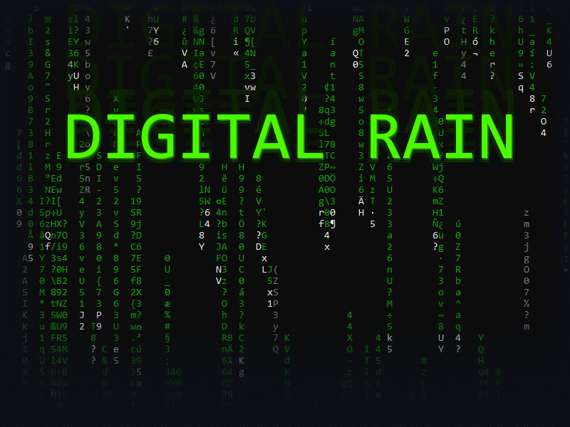

# Matrix Digital Rain Simulation



Welcome to the Matrix Digital Rain Simulation repository! This project is a C# console application that mimics the iconic digital rain effect seen in The Matrix film series. The application creates a visual spectacle in your console, with glyphs raining down the screen in a manner reminiscent of the film's famous visual effect.

## Overview

The Digital Rain Simulation is designed to run in a console window on Windows only, utilizing C# and the .NET framework to create a dynamic and visually appealing simulation of the Matrix's digital rain. This project serves as both a homage to the film and a practical exercise in C# programming.

## Features

- **Digital Rain Effect**: Creates a captivating display of Matrix-like glyphs flowing down the console screen.
- **Customizable Glyphs**: Allows for easy customization of the characters used in the digital rain, enabling you to create various visual styles.

## Getting Started

To run the Matrix Digital Rain Simulation, you'll need to have the .NET SDK installed on your computer. After cloning this repository, it's essential to restore the required NuGet packages to ensure all dependencies are correctly installed. Follow these steps to get started:


1. Open the `.csproj` file in your preferred IDE (such as JetBrains Rider and MS Visual Studio).
2. Restore the NuGet packages through the IDE's package management tools.
3. Then build and run the application directly within the IDE.

Alternatively, you can use command lines:

1. Navigate to the project's directory in your terminal or command prompt.
2. Restore the NuGet packages by running the following command:
   ```bash
   dotnet restore
   ```
3. Once the packages are restored, you can build and run the application using the dotnet CLI:
   ```bash
   dotnet build
   dotnet run
   ```

The application's executable will also be available under `bin\Debug` after building, which you should run directly.
Running it within JetBrains Rider debug console is not recommended.

## Customization

The application's source code includes variables that control aspects of the digital rain, such as the glyphs used (limited to ASCII), their color, and the speed of their descent. Feel free to modify these variables to customize the simulation to your liking.

## Configuration Options

The Matrix Digital Rain Simulation offers several configuration options to customize the appearance and behavior of the digital rain effect. These options are accessible within the application's source code and can be adjusted to modify various aspects of the simulation. Below is a list of the configurable options along with their descriptions:

- **ForegroundColor**: Sets the primary color of the digital rain glyphs. This color is used for the majority of the characters that make up the rain effect. The default color is `ConsoleColor.DarkGreen`.

- **HighlightColor**: Determines the color of highlighted glyphs that occasionally appear to simulate brighter drops within the digital rain. This adds depth and variation to the simulation. The default highlight color is `ConsoleColor.Green`.

- **CharacterColor**: Specifies the color of the static characters that remain on the screen momentarily before fading away. This color contrasts with the moving glyphs to create a dynamic visual effect. The default color for these characters is `ConsoleColor.White`.

- **RefreshRate**: Controls the speed at which the screen is refreshed, effectively determining the speed of the digital rain. The value is in milliseconds, with a lower number resulting in a faster drop speed. Note that been single threaded and limited by the console cursor speed, the bigger the window, the slower the max speed gets. The default refresh rate is 50 milliseconds.

- **WindowScale**: Sets the scale of the console window relative to the maximum window size supported by the system. A value of 1f uses the full screen (the default), while a value of 0.5f scales the window to half of the maximum size.

- **MinDropLength**: Specifies the minimum length of the digital raindrops. This value determines the shortest possible length for any single drop in the simulation. The default minimum length is 3.

- **MaxDropLength**: Defines the maximum length of the digital raindrops. This value sets the upper limit for how long a drop can be, allowing for variation in the lengths of different drops within the simulation. The default maximum length is 25.

To customize these options, locate the `Config` class within the application's source code and adjust the properties as desired. These changes will be reflected the next time you run the simulation, allowing for a personalized Matrix digital rain experience.

For users interested in customizing the characters used in the digital rain, including their range (under Extended ASCII 0-255) and the chance of occurrence, you can modify the `RandomChar` function within the application's source code. This function controls the selection of characters and their distribution, allowing for a deeper level of customization.

## Contributing

This project is primarily for personal learning and experimentation. Contributions are not actively sought, but suggestions for improvements or enhancements are welcome. If you have ideas or feedback, please feel free to open an issue or submit a pull request.

## License

This Matrix Digital Rain Simulation is made available under the MIT License. It is intended for educational and entertainment purposes. Please see the [LICENSE](LICENSE) file for full license details. Note that this project is provided "as is," without warranty of any kind.


## Skills used
Tags: #:CS, #:Console, #:Art
